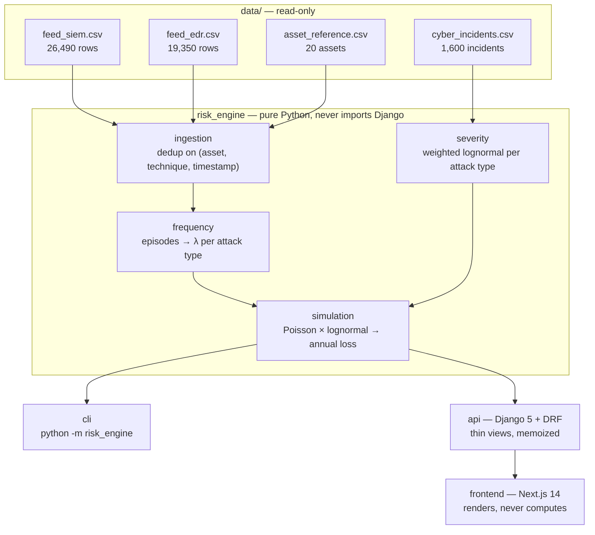

# Methodology

How the annualized loss figure is built, and what it rests on. The short version
lives in [`README.md`](README.md); this is the argument behind it.

## The headline

```
AAL          EUR   273,704        VaR 95   EUR     816,323
median year  EUR         0        VaR 99   EUR   6,665,810
P(no loss)        73.7%           TVaR 99  EUR  15,134,257
                                 100,000 simulated years, seed 42
```

Three years in four cost nothing; the average year costs €274k because roughly
one year in twenty is expensive and one in a hundred is severe. That shape —
mostly quiet, occasionally ruinous — is what a cyber loss distribution looks
like, and reproducing it is the point.

**Each incident is capped at €23,476,094** — the 99.9th percentile of the 1,598
cleaned peer losses. A lognormal has no upper bound, and at the sigmas this data
produces (up to 2.58) a 100,000-year run eventually draws a single incident
costing more than the company is worth: uncapped, the worst simulated year here
reached **€3.8 billion** for a company of 1,200 people. That is the functional
form extrapolating past every observation it was fitted on, not evidence.

The cap is not cosmetic, and the effect is reported rather than absorbed:
0.9% of drawn incidents hit the ceiling, and they carried **37.5% of the
uncapped AAL** (€438,038 → €273,704). VaR 95 and VaR 99 do not move at all — the
cap binds only beyond the 99th percentile of *annual* loss — while TVaR 99 falls
52%. Pass `loss_cap_eur` to `POST /api/simulate/` to change it, or `math.inf` to
run genuinely uncapped.

**The number rests on one conversion that is worth understanding before trusting
it.** The telemetry counts *detected attacks*: 911 episodes over 212 days, or
1,568 per year. The incident base prices *losses*. Those are different units, and
multiplying one by the other prices every alert as a breach — which is how an
earlier version of this engine produced an annual loss of €12.5 billion for a
1,200-employee company.

The bridge is calibrated, not assumed:

```
1,568.5 detected attacks/yr  x  p_materialize 1.95e-04  =  0.3052 loss incidents/yr
                                                           ^
              anchored on 1,600 incidents at 1,310 peer organisations over 3.99 years,
              weighted by the same sector/size/maturity kernel the severity model uses
```

The consequence, stated plainly: **the incident rate is now set entirely by the
peer base, and the telemetry contributes only the attack-type mix.** Changing the
severity threshold or the session window moves the detected rate thirty-fold and
leaves the loss rate untouched. That is deliberate and it is a limitation —
`next_steps.md` item 1 is the credibility blend that would give this company's own
evidence back some weight.

Two other things a reader should know:

- **`data_breach` drives 46% of the AAL** on 19% of the episodes, because its
  fitted mean loss is €4.8M against a €571k pooled mean. The answer is sensitive
  to the technique-to-attack-type mapping in a way the headline does not show.
- **The Pareto diagnostic says five of eight tails are understated**, so VaR 99
  and TVaR 99 should be read as lower bounds.

## Architecture



`risk_engine` is the deliverable. It is a pure Python package with no Django
import anywhere — a test walks every module in a subprocess to prove it — so it
runs from a notebook, a CLI or a test with no settings module in sight. Django and
Next.js are presentation layers over it.

## Modeling choices & justification

Each of these is argued at length in the notebook section or annex named beside
it, and each is implemented as a named constant or parameter rather than a magic
number.

- **Cross-feed dedup** — 12,343 events carry an identical *(asset, MITRE
  technique, timestamp)* triple in both feeds, so the feeds are two partial
  observers of one stream; concatenating them would inflate every rate by 42%.
  Deduplication is a set operation over the union, keeping the worst observed
  severity. *(notebook §3)*
- **Annualization** — the factor is `365 / observed_days` computed from the data
  (212 calendar days → 1.7217), never a hardcoded horizon, so a longer export
  changes the answer by itself. *(notebook §2)*
- **Episodes, not alerts** — an intrusion produces a burst of detections, so
  attack-grade events are clustered per *asset* within a 24-hour quiet window —
  one asset in one window is one attack, whatever mix of techniques fired. Counting alerts would measure the estate's detection verbosity
  rather than how often it is attacked. *(notebook §5, `prompts/03_frequency.md`)*
- **Soft peer weighting** — filtering to exact peers keeps 112 of 1,598 incidents
  and leaves *zero* of eight attack types with a credible sample, so every
  incident contributes in proportion to sector, size and a Gaussian kernel on
  maturity distance, and every fit reports its Kish effective sample size.
  *(notebook §8, `prompts/04_severity.md`)*
- **Lognormal on the log scale** — losses are heavy-tailed (mean 15.6× the
  median, skewness 7.4); logs remove almost all of it (skewness 0.80). A single
  *pooled* lognormal is nonetheless rejected by KS, because the base is a mixture
  of five severity strata — hence one fit per attack type, each shipping its KS
  statistic, QQ points and a Pareto tail fitted as a rival. *(notebook §7)*
- **Detected attacks ≠ loss incidents** — the telemetry counts detections, the
  incident base prices losses, and multiplying the two directly is a category
  error. A fitted `p_materialize` bridges them, anchored on the peer-weighted
  base rate of 0.3052 incidents per organisation-year. *(`prompts/11_calibration.md`)*
- **Monte Carlo aggregation** — frequency and severity compound rather than
  multiply: each simulated year draws a Poisson count per attack type from the
  *incident* rate and a loss per incident, then sums. Vectorized across blocks of
  years, every draw seeded, and `TVaR ≥ VaR` asserted as an invariant.
  *(`prompts/05_simulation.md`)*

## Known limitations

- **The Pareto rival beats the lognormal on five of eight tails**, twice with
  α < 1. The lognormal likely understates the extremes VaR and TVaR are made of.
- **`p_materialize` is one fitted scalar** absorbing sensor noise, control
  quality and response speed. It is the single most influential number in the
  pipeline and has no structure. Giving it one needs an exposure denominator the
  incident base does not carry, so it is left visibly as one number doing one job.
- **The telemetry no longer affects how often losses occur**, only what kind.
- **`supply_chain` and `insider_error` get λ = 0.** No ATT&CK technique in either
  feed corresponds to them, though the incident base holds 78 and 129 such
  incidents. The zero means *unobservable from this telemetry*, not *no risk*, and
  the trace says so on the line.
- **The technique → attack-type mapping is a judgment call.** Four attributions
  are marked `ARGUABLE` in `risk_engine/frequency/attack_types.py` with their
  alternative and their event weight.

## Where the reasoning lives

| Path | What it holds |
|---|---|
| `notebooks/01_eda.ipynb` | The data audit that every modeling constant is argued from — executed, with outputs |
| `prompts/` | One annex per feature: the prompt, the decisions taken, and what was flagged |
| `next_steps.md` | What was deliberately not built, and why |
| `results.json` | Every figure plus its explanation, regenerated by `make run` |
