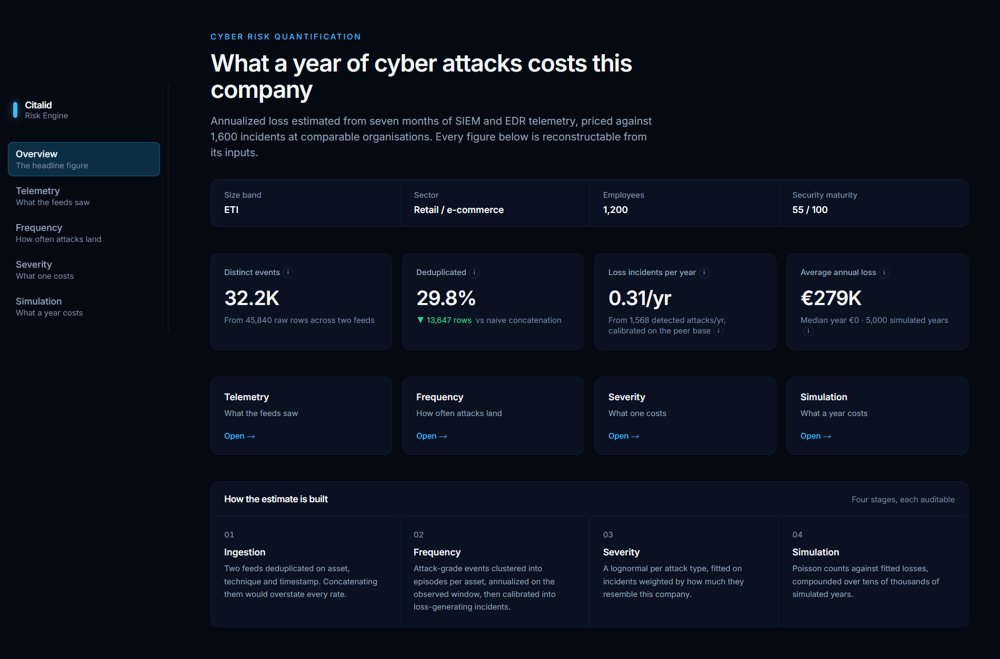
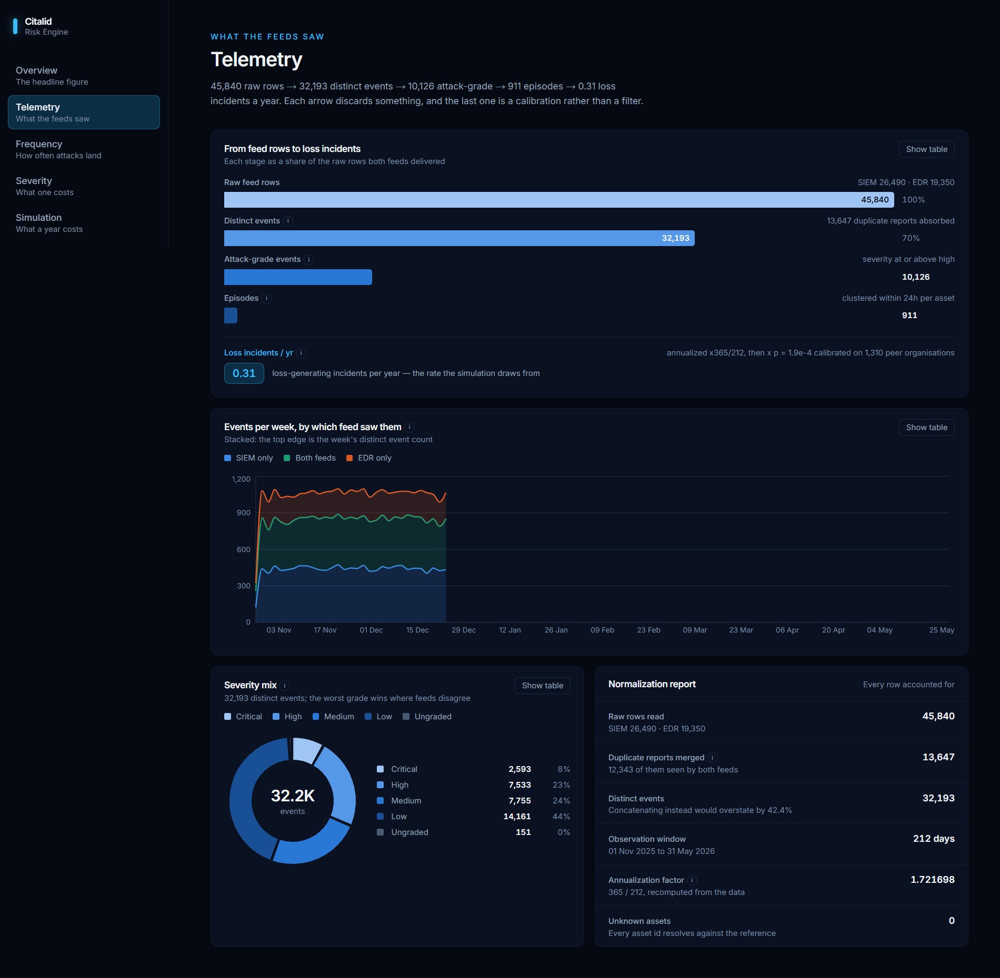
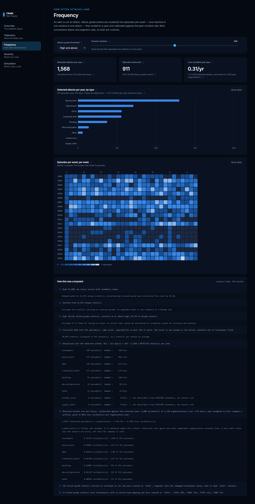
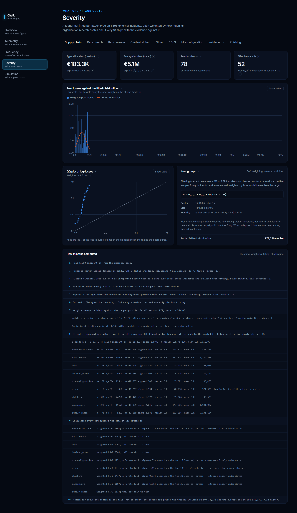
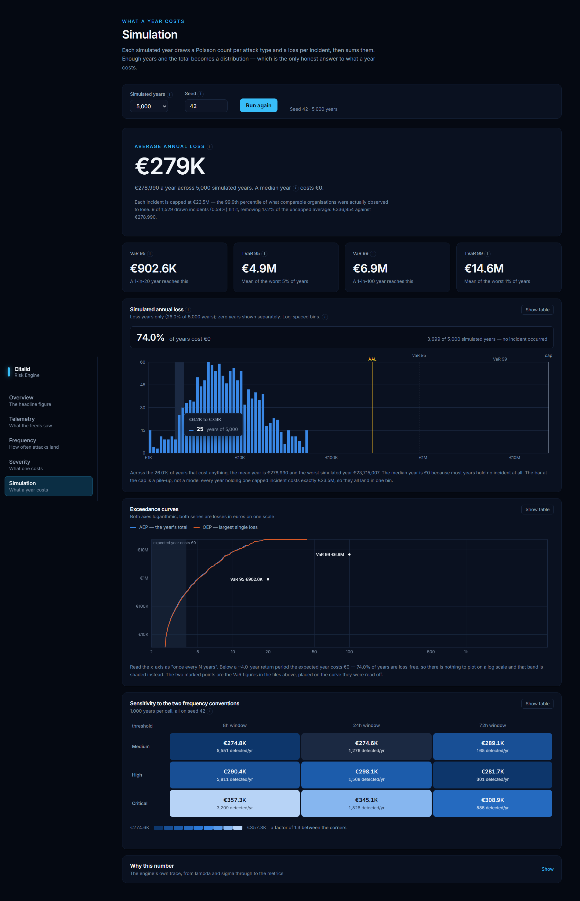

# Citalid Risk Engine

Estimating the **annualized cyber loss** of an ETI in Retail/e-commerce — 1,200
employees, security maturity 55/100, ~20 assets — from seven months of SIEM and
EDR telemetry and an external base of 1,600 incidents.

Every figure can be traced back to its inputs: each stage returns a
`to_explanation()` that renders the numbered chain from raw CSV rows to euros,
and that same chain is what the CLI prints, the API serves and the UI displays.

```
AAL          EUR   273,704        VaR 95   EUR     816,323
median year  EUR         0        VaR 99   EUR   6,665,810
P(no loss)        73.7%           TVaR 99  EUR  15,134,257
                                 100,000 simulated years, seed 42
```

## Features

- **Cross-feed ingestion** — SIEM and EDR normalized to one event schema and
  deduplicated on *(asset, MITRE technique, timestamp)*. 13,647 duplicate
  reports absorbed; concatenating instead would overstate every rate by 42%.
- **Frequency from episodes, not alerts** — attack-grade events clustered per
  asset within a quiet window, annualized from the observed window, then
  **calibrated** into loss-generating incidents against the peer base. Detected
  attacks and loss incidents are different units, and the engine refuses to
  multiply one by the other.
- **Severity by soft peer weighting** — a lognormal fitted per attack type on
  incidents weighted by sector, size band and a Gaussian kernel on maturity
  distance. No hard filtering; every fit reports its Kish effective sample size
  and falls back to pooled below 30.
- **Monte Carlo aggregation** — Poisson counts × lognormal losses over 100,000
  seeded years, giving AAL, VaR/TVaR at 95 and 99, OEP/AEP exceedance curves and
  a 3×3 sensitivity grid over the two frequency conventions.
- **A plausibility cap** on each incident, at the 99.9th percentile of observed
  peer losses — an unbounded lognormal otherwise draws single losses larger than
  the company is worth. The effect is reported, not absorbed.
- **Explainability throughout** — every model object renders a numbered audit
  trail, every chart has a table twin, and every mathematical concept in the UI
  carries a plain-language tooltip.
- **A roadmap page** — the next steps as a timeline, each stating what
  exists today, what would change, and what the number or the product gains.

## Screenshots

**Overview** — the headline figure and the four stages behind it.



**Telemetry** — raw rows to loss incidents, and the normalization accounting.



**Frequency** — episodes per asset per week, λ by attack type, live controls for
the two conventions.



**Severity** — the fitted distribution per attack type, with QQ plot, KS
distance and the peer-weighting scheme.



**Simulation** — annual loss distribution, exceedance curves and the sensitivity
grid.



## Stack

| Layer | What it is |
|---|---|
| `backend/risk_engine/` | **Pure Python 3.11.** numpy, pandas, scipy. Never imports Django — a test walks every module in a subprocess to prove it. This is the deliverable. |
| `backend/api/` | Django 5 + DRF + drf-spectacular. Thin views: parse, call the engine, serialize. |
| `frontend/` | Next.js 14 app router, TypeScript, Tailwind, framer-motion, recharts. Renders API responses, never computes risk maths. |
| Tooling | ruff, mypy (strict on `risk_engine`), pytest, vitest + testing-library, pre-commit |

## Running it

Requires Python 3.11+ and Node 20+.

```bash
make install     # editable backend install, pre-commit hooks, npm install
make lint        # ruff, ruff format, mypy strict, next lint + tsc
make test        # 272 backend tests (99% coverage on risk_engine) + 42 frontend
```

**The whole pipeline, no server:**

```bash
make run         # python -m risk_engine --data-dir data --out results.json
```

Prints every stage's numbered trace and writes `results.json` with both the
figures and the explanations. Roughly 35 seconds for 100,000 simulated years.

```bash
python -m risk_engine --data-dir data --years 10000 --sensitivity-years 0
python -m risk_engine --help
```

**The two services:**

```bash
make api         # Django on :8000
make web         # Next.js on :3000
make eda         # the exploratory notebook
```

| URL | What it is |
|---|---|
| http://localhost:3000 | The risk cockpit — the five pages above, plus `/roadmap` |
| http://localhost:8000/api/docs/ | Swagger UI over the five endpoints |
| http://localhost:8000/api/schema/ | The OpenAPI schema |

`make docker-up` brings the same two services up in containers. There is no
hosted demo; both URLs are local.

## Further reading

| Path | What it holds |
|---|---|
| [`METHODOLOGY.md`](METHODOLOGY.md) | How the number is built, the modeling choices and their justification, known limitations |
| [`DEPLOYMENT.md`](DEPLOYMENT.md) | Deploying the API and frontend, and the free-tier constraints that shaped the defaults |
| [`business_logic.pdf`](business_logic.pdf) | Business logic page by page: the endpoint, its parameters, the call chain, the maths, and the answer to give out loud. French version: [`logique_metier.pdf`](logique_metier.pdf) |
| [`CONCEPTS.md`](CONCEPTS.md) | *En français.* Every mathematical concept the roadmap rests on, from zero: definition, intuition, the maths, and a worked example on small numbers |
| [`next_steps.md`](next_steps.md) | What was deliberately not built, and why |
| [`notebooks/01_eda.ipynb`](notebooks/01_eda.ipynb) | The data audit every modeling constant is argued from |
| [`PROMPTS.md`](PROMPTS.md) | One annex per feature: the prompt, the decisions taken, what was flagged |
