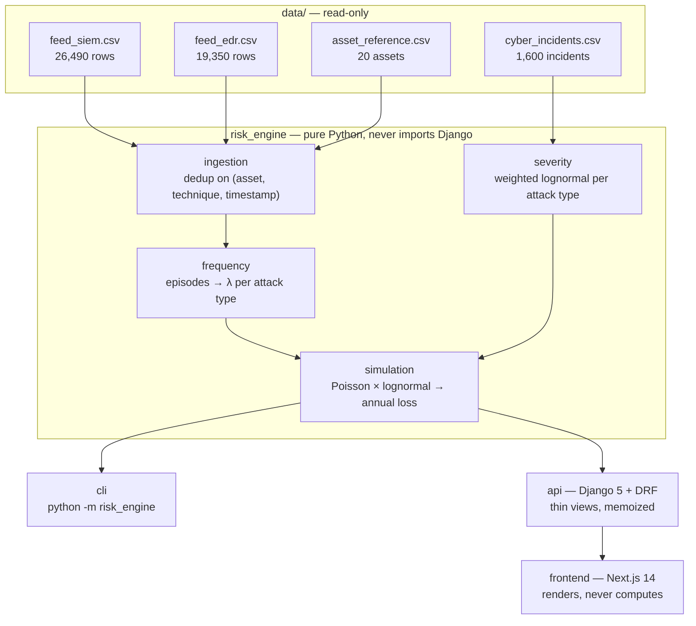

# Citalid Risk Engine

Estimating the **annualized cyber loss** of an ETI in Retail/e-commerce — 1,200
employees, security maturity 55/100, ~20 assets — from seven months of SIEM and
EDR telemetry and an external base of 1,600 incidents.

The point is not the number. The point is that **every figure can be traced back
to its inputs**: each stage of the model returns a `to_explanation()` that
renders the numbered chain from raw CSV rows to euros, and that same chain is
what the CLI prints, what the API serves, and what the web UI displays.

## The headline, and its caveat

```
AAL       EUR 12,471,807,357        VaR 99   EUR 22,987,482,942
median    EUR 11,867,291,411        TVaR 99  EUR 32,388,088,830
                                    100,000 simulated years, seed 42
```

**That figure is arithmetically correct and indefensible as a risk estimate**, and
the engine says so on its own trace. It follows from an attack frequency of
**9,168 per year** — roughly 25 successful attacks a day on a 20-asset estate —
which is what the supplied telemetry implies once 31.5% of its events are graded
high or critical.

A subtler consequence matters more than the inflation: at that rate the annual
total is nearly deterministic. The AAL sits only **1.1× the median year**, no year
in 100,000 is loss-free, and VaR 99 is under 2× the AAL. The central limit theorem
flattens 9,168 draws a year into a near-Gaussian aggregate, so the implausible
frequency does not merely inflate the answer — **it removes the shape** the
exercise exists to show.

The built-in sensitivity grid spans a factor of **7.2** across every defensible
setting of the two frequency conventions, and no cell rescues the figure. That is
itself the finding: the problem is the input telemetry's severity distribution,
not a parameter choice. See `prompts/05_simulation.md` for the full argument.

## Architecture



`risk_engine` is the deliverable. It is a pure Python package with no Django
import anywhere — a test walks every module in a subprocess to prove it — so it
runs from a notebook, a CLI or a test with no settings module in sight. Django and
Next.js are presentation layers over it.

## Quickstart

Requires Python 3.11+ and Node 20+.

```bash
make install     # editable backend install, pre-commit hooks, npm install
make lint        # ruff, ruff format, mypy strict on risk_engine, next lint
make test        # 243 tests, 99% coverage
```

**Run the whole pipeline with no server at all:**

```bash
make run         # python -m risk_engine --data-dir data --out results.json
```

It prints every stage's numbered trace and writes `results.json` holding both the
figures and the explanations. Roughly 35 seconds for 100,000 simulated years.

```bash
python -m risk_engine --data-dir data --years 10000 --sensitivity-years 0   # faster
python -m risk_engine --help
```

**Or run the two services:**

```bash
make api         # Django on :8000
make web         # Next.js on :3000
make eda         # the exploratory notebook
```

| URL | What it is |
|---|---|
| http://localhost:3000 | The risk cockpit — overview, telemetry, frequency, severity, simulation |
| http://localhost:8000/api/docs/ | Swagger UI over the five endpoints |
| http://localhost:8000/api/schema/ | The OpenAPI schema |

There is **no hosted demo**; both URLs are local. `make docker-up` brings the same
two services up in containers.

## Deployment

The two halves deploy separately: the API as a container, the frontend as a
static-plus-SSR Next.js app. Deploy the API first — the frontend needs its URL at
build time.

### 1. The API on Render

`render.yaml` defines the service, so a blueprint deploy picks it up. Or by hand:

1. **New → Web Service**, connect the repository.
2. **Runtime: Docker.** Dockerfile path `./backend/Dockerfile`, Docker context
   `.` — the image needs `data/` as well as `backend/`, so the context is the
   repository root.
3. **Health check path** `/api/health/`.
4. **Environment variables:**

   | Key | Value |
   |---|---|
   | `DJANGO_SETTINGS_MODULE` | `api.settings.prod` |
   | `SECRET_KEY` | generate one — the settings refuse to boot without it |
   | `DEBUG` | `0` |
   | `ALLOWED_HOSTS` | the service hostname, e.g. `citalid-risk-engine-api.onrender.com` |
   | `CORS_ALLOWED_ORIGINS` | the Vercel URL, scheme included |
   | `SECURE_SSL_REDIRECT` | `0` — Render terminates TLS in front of the container |
   | `RISK_ENGINE_WARM_START` | `1` |

5. **Deploy.** First build is a few minutes; the dataset is baked into the image,
   so there is no volume to attach and no storage to configure.

`ALLOWED_HOSTS` and `CORS_ALLOWED_ORIGINS` are marked `sync: false` in the
blueprint because neither is known until both services exist.

### 2. The frontend on Vercel

1. **Import the repository**, set **Root Directory** to `frontend`.
2. Set **`NEXT_PUBLIC_API_URL`** to the Render URL, for all environments.
3. **Deploy**, then add the resulting Vercel URL to the API's
   `CORS_ALLOWED_ORIGINS` and redeploy the API.

`NEXT_PUBLIC_*` is **inlined at build time**, so changing it later requires a
rebuild, not just a restart. See [`frontend/README.md`](frontend/README.md).

### Cold starts on free tiers

Render's free tier **stops the container after ~15 minutes idle**, and the next
request pays the full spin-up. On top of that, this service loads four CSVs,
deduplicates 45,840 rows and fits nine severity distributions before it can
answer anything.

Two things reduce the damage, and neither eliminates it:

- `RISK_ENGINE_WARM_START=1` runs that work on a **background thread at boot**,
  so the port binds and `/api/health/` answers immediately while the model
  loads. The health check passes early; the first *data* request may still wait.
- Every stage is memoized per worker, and the default-parameter simulation is
  cached during the warm-up — so the landing page hits a warm cache, and only a
  request with unusual parameters computes anything.

**Expect the first request after an idle period to take 30–60 seconds.** That is
the free tier, not the engine. A paid instance that never sleeps removes it
entirely; so does any always-on host.

### Memory on a 512 MB instance

The image runs **one gunicorn worker** by default. Each worker holds its own copy
of the loaded dataset and fitted model — around 200 MB — so two of them plus a
simulation's working arrays do not fit in the 512 MB a free instance gets. Two
workers OOM-kill the process within seconds of the first `POST /api/simulate/`.

Raise `WEB_CONCURRENCY` on an instance with the memory for it; no rebuild needed.
Measured on a 512 MB container: 138 MB idle, 152 MB after a 200,000-year run.

### CPU, and why the API's defaults are smaller than the CLI's

A free instance runs at roughly **4.2 ms per simulated year** — about fourteen
times slower than a workstation. The API therefore defaults to a **5,000-year**
simulation and a **9 × 1,000-year** sensitivity grid, which the background
warm-up absorbs in about a minute. The earlier defaults — 25,000 years plus a
9 × 10,000 grid — needed some eight minutes of CPU and never survived the
gateway timeout, so every uncached request returned 502.

Three environment variables tune this without a rebuild:

| Variable | Default | What it does |
|---|---|---|
| `RISK_ENGINE_DEFAULT_YEARS` | `5000` | Years the API simulates when the caller does not say |
| `RISK_ENGINE_SENSITIVITY_YEARS` | `1000` | Years per cell of the 3×3 grid |
| `RISK_ENGINE_MAX_YEARS` | `200000` | Hard cap on what a caller may request |

The CLI is untouched at 100,000 years — it has a whole machine to itself.

On a free instance, raising `n_years` from the UI still works but is slow: 25,000
years is about two minutes of compute, and anything past that will outlive the
platform's request timeout. Lower `RISK_ENGINE_MAX_YEARS` if you would rather the
API refuse those requests than hang on them.

The simulation endpoint is capped at **200,000 years** and defaults to 25,000
precisely because one caller should not be able to occupy a worker indefinitely
on an instance this small.

## Where the reasoning lives

| Path | What it holds |
|---|---|
| `notebooks/01_eda.ipynb` | The data audit that every modeling constant is argued from — executed, with outputs |
| `prompts/` | One annex per feature: the prompt, the decisions taken, and what was flagged |
| `next_steps.md` | What was deliberately not built, and why |
| `results.json` | Every figure plus its explanation, regenerated by `make run` |

## Modeling choices & justification

Each of these is argued at length in the notebook section or annex named beside
it, and each is implemented as a named constant or parameter rather than a magic
number.

- **Cross-feed dedup** — 12,343 events carry an identical *(asset, MITRE
  technique, timestamp)* triple in both feeds, so the feeds are two partial
  observers of one stream; concatenating them would inflate every rate by 42%.
  Deduplication is a set operation over the union, keeping the worst observed
  severity. *(notebook §3)*
- **Annualization** — the factor is `365 / observed_days` computed from the data
  (212 calendar days → 1.7217), never a hardcoded horizon, so a longer export
  changes the answer by itself. *(notebook §2)*
- **Episodes, not alerts** — an intrusion produces a burst of detections, so
  attack-grade events are clustered per *(asset, attack type)* within a 24-hour
  quiet window. Counting alerts would measure the estate's detection verbosity
  rather than how often it is attacked. *(notebook §5, `prompts/03_frequency.md`)*
- **Soft peer weighting** — filtering to exact peers keeps 112 of 1,598 incidents
  and leaves *zero* of eight attack types with a credible sample, so every
  incident contributes in proportion to sector, size and a Gaussian kernel on
  maturity distance, and every fit reports its Kish effective sample size.
  *(notebook §8, `prompts/04_severity.md`)*
- **Lognormal on the log scale** — losses are heavy-tailed (mean 15.6× the
  median, skewness 7.4); logs remove almost all of it (skewness 0.80). A single
  *pooled* lognormal is nonetheless rejected by KS, because the base is a mixture
  of five severity strata — hence one fit per attack type, each shipping its KS
  statistic, QQ points and a Pareto tail fitted as a rival. *(notebook §7)*
- **Monte Carlo aggregation** — frequency and severity compound rather than
  multiply: each simulated year draws a Poisson count per attack type and a loss
  per incident, then sums. Vectorized across blocks of years, every draw seeded,
  and `TVaR ≥ VaR` asserted as an invariant. *(`prompts/05_simulation.md`)*

## Known limitations

Beyond the frequency problem above:

- **The Pareto rival beats the lognormal on five of eight tails**, twice with
  α < 1. The lognormal likely understates the extremes VaR and TVaR are made of.
- **`supply_chain` and `insider_error` get λ = 0.** No ATT&CK technique in either
  feed corresponds to them, though the incident base holds 78 and 129 such
  incidents. The zero means *unobservable from this telemetry*, not *no risk*, and
  the trace says so on the line.
- **The technique → attack-type mapping is a judgment call.** Four attributions
  are marked `ARGUABLE` in `risk_engine/frequency/attack_types.py` with their
  alternative and their event weight.
- **The web UI has not been visually reviewed.** It builds clean and every page
  was verified against live data, but no browser was available during
  development.
